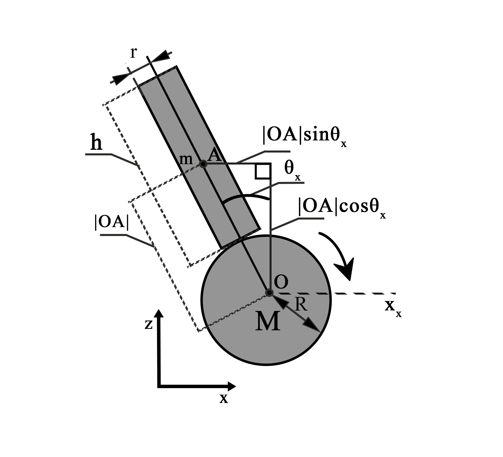
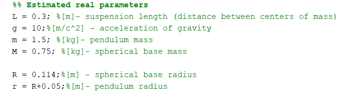
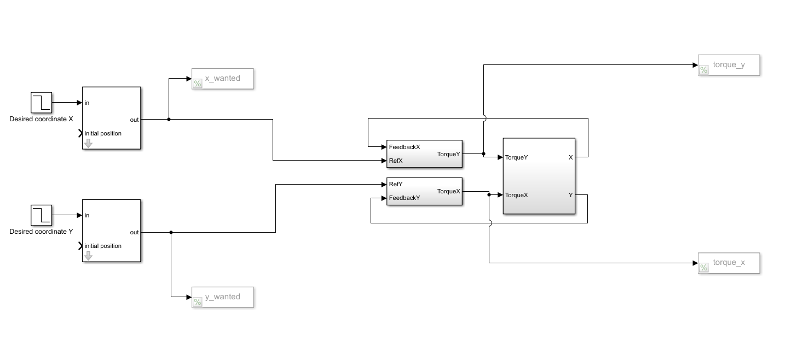
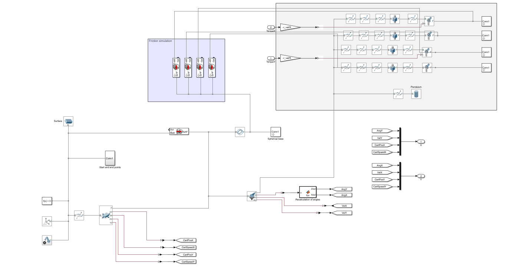
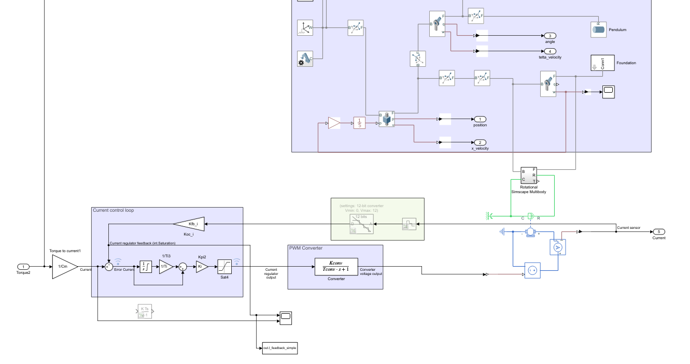

# Dynamic-Stability-Analysis-of-Robots-on-Spherical-Base-
This repository contains mathematical models in the MATLAB that allow you to evaluate the requirements for an electric drive when setting your initial parameters for a balancing robot on a spherical base

These models describe the balancing of a cylinder with a certain mass, simulating a balancing weight, on a spherical base with torque transmission using 4 rotational rollers. The movement is trajectory, the trajectory is built using the trajectory designer.

For more information on deriving equations of motion and creating a trajectory designer, see the article [«Dynamic Stability Analysis of Robots on Spherical Base with Variable Load Mass» ]( https://ieeexplore.ieee.org/document/9722600).

1. To determine the parameters of the engine, it is necessary to analyze the graphs obtained during the initial simulation.
Figure shows a visual simplified representation of a robot on a spherical base.

You need to set the initial parameters corresponding to your robot in the [‘Initial_code.m’] (/Initial_code)  [`Initial_code.m`](/Initial_code.m)code.

2. Next, you need to run the [‘moment_velocity_plot.m’] (/moment_velocity_plot) and analyze the resulting graphs, determining the maximum speed and moment of the rotational rollers. These will be the maximum values that the drive you have chosen should provide.

3. The parameters of the selected motor must be written to the [‘drive_params.m’] (/drive_params.m’) file.
To verify the parameters of the selected engine, it is necessary to run the [‘drive_impl.slx’] (/drive_impl.slx) model with the [‘drive_impl_code.slx ‘]code(/drive_impl_code.slx code).
Because this modeling format assumes the presence of large computing power; for verification, a variant with balancing at one point and a simple state controller is used.

